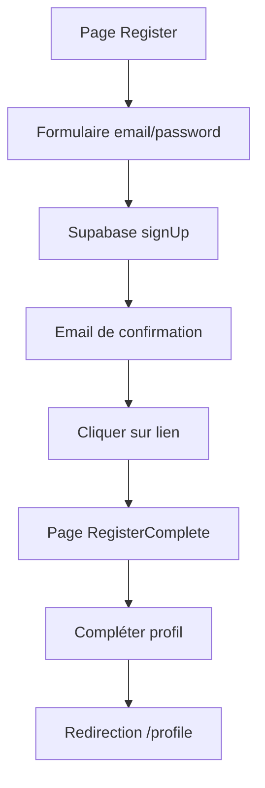
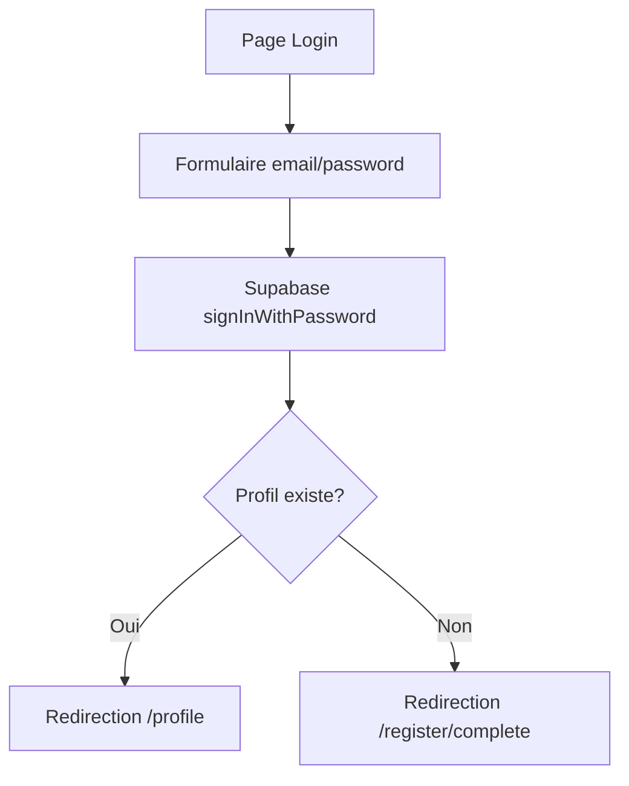
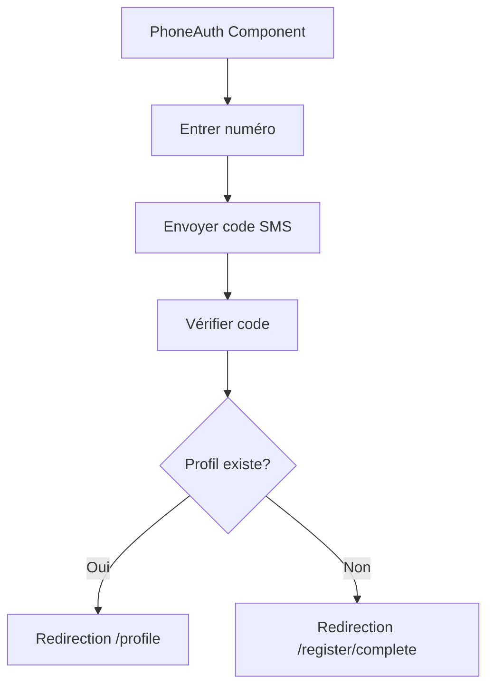

# Logique d'Authentification et de Redirection

## Vue d'ensemble

Ce document décrit la logique centralisée d'authentification et de redirection implémentée dans l'application Zodiak.

## Architecture

### 1. Hook `useAuth` (src/lib/hooks/useAuth.tsx)

**Responsabilités :**
- Gestion de l'état d'authentification global
- Synchronisation avec Supabase Auth
- Gestion du profil utilisateur
- Nettoyage du cache lors des changements d'état

**États gérés :**
- `isAuthenticated` : Utilisateur connecté ou non
- `isLoading` : État de chargement
- `user` : Données utilisateur Supabase
- `profile` : Profil utilisateur complet
- `session` : Session Supabase

### 2. Hook `useAuthRedirect` (src/lib/hooks/useAuthRedirect.ts)

**Responsabilités :**
- Centralisation de toute la logique de redirection
- Détermination automatique de la route appropriée
- Gestion des redirections basées sur l'état d'authentification

**Logique de redirection :**
```typescript
// Utilisateur non authentifié → /login
if (!isAuthenticated) {
  navigate('/login', { replace: true });
}

// Utilisateur authentifié sans profil → /register/complete
if (isAuthenticated && !profile) {
  navigate('/register/complete', { replace: true });
}

// Utilisateur authentifié avec profil → /profile
if (isAuthenticated && profile) {
  navigate('/profile', { replace: true });
}
```

### 3. Service `AuthRedirectService` (src/lib/services/AuthRedirectService.ts)

**Responsabilités :**
- Logique métier pour les redirections
- Validation des routes accessibles
- Configuration centralisée des routes

## Flux d'Authentification

### 1. Inscription par Email



### 2. Connexion par Email



### 3. Authentification SMS



## Routes et Accès

### Routes Publiques
- `/` : Page d'accueil
- `/login` : Page de connexion
- `/register` : Page d'inscription
- `/register/complete` : Complétion du profil

### Routes Privées (Authentification requise)
- `/profile` : Profil utilisateur
- `/guidance` : Guidance astrologique
- `/natal` : Thème natal

### Logique d'Accès
```typescript
// Routes publiques : toujours accessibles
const publicRoutes = ['/', '/login', '/register', '/register/complete'];

// Routes privées : authentification requise
if (!isAuthenticated) {
  redirectTo('/login');
}

// Routes avec profil : profil complet requis
const profileRequiredRoutes = ['/profile', '/guidance', '/natal'];
if (profileRequiredRoutes.includes(route) && !profile) {
  redirectTo('/register/complete');
}
```

## Gestion des États

### États de Chargement
```typescript
if (isLoading) {
  return <LoadingComponent />;
}
```

### États de Redirection
```typescript
if (shouldRedirect) {
  return <RedirectComponent />;
}
```

### États d'Erreur
```typescript
if (error) {
  return <ErrorComponent message={error} />;
}
```

## Composant PrivateRoute

Le composant `PrivateRoute` utilise la logique centralisée pour protéger les routes :

```typescript
function PrivateRoute({ children }) {
  const { isAuthenticated, isLoading } = useAuth();
  const { shouldRedirect } = useAuthRedirect();

  if (isLoading) return <LoadingComponent />;
  if (!isAuthenticated) return <Navigate to="/login" />;
  if (shouldRedirect) return <Navigate to="/register/complete" />;

  return children;
}
```

## Gestion du Cache

### Nettoyage Automatique
- Le cache utilisateur est nettoyé lors de la déconnexion
- Le cache est nettoyé lors de la reconnexion pour éviter les données obsolètes

### Persistance
- Le profil utilisateur est mis en cache localement
- La session Supabase est gérée automatiquement

## Bonnes Pratiques

### 1. Utilisation des Hooks
```typescript
// ✅ Bon
const { isAuthenticated, isLoading, profile } = useAuth();
const { shouldRedirect } = useAuthRedirect();

// ❌ Mauvais
const [authState, setAuthState] = useState({});
```

### 2. Gestion des Redirections
```typescript
// ✅ Bon - Utiliser le hook centralisé
const { shouldRedirect } = useAuthRedirect();

// ❌ Mauvais - Redirections manuelles dans chaque composant
useEffect(() => {
  if (isAuthenticated && !profile) {
    navigate('/register/complete');
  }
}, [isAuthenticated, profile]);
```

### 3. Gestion des États de Chargement
```typescript
// ✅ Bon
if (isLoading) {
  return <LoadingComponent />;
}

// ❌ Mauvais
if (isLoading) {
  return null;
}
```

## Dépannage

### Problèmes Courants

1. **Redirections en boucle**
   - Vérifier que `useAuthRedirect` n'est pas appelé plusieurs fois
   - S'assurer que les conditions de redirection sont mutuellement exclusives

2. **États incohérents**
   - Vérifier que `useAuth` est bien initialisé
   - S'assurer que le cache est nettoyé correctement

3. **Profil non chargé**
   - Vérifier que `StorageService.getProfile()` fonctionne
   - S'assurer que la requête Supabase réussit

### Debugging

```typescript
// Ajouter des logs pour déboguer
console.log('Auth state:', { isAuthenticated, isLoading, profile });
console.log('Redirect state:', { shouldRedirect, redirectTo });
```

## Évolutions Futures

1. **Gestion des rôles** : Ajouter un système de rôles pour des accès plus granulaires
2. **Sessions multiples** : Gérer plusieurs sessions simultanées
3. **Authentification sociale** : Ajouter Google, Facebook, etc.
4. **2FA** : Implémenter l'authentification à deux facteurs 