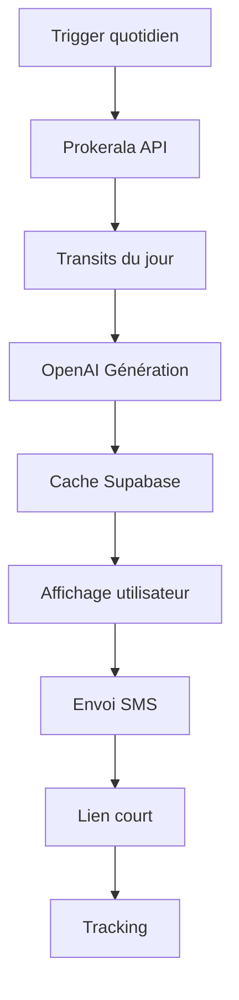
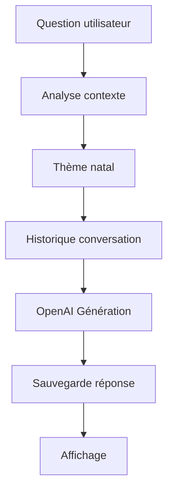

# Résumé Complet du Workflow de l'Application Zodiak

## 🎯 Vue d'Ensemble

L'application Zodiak est une plateforme d'astrologie personnalisée qui combine authentification, génération de guidance quotidienne, envoi SMS et chat astrologique.

## 🔄 Workflows Principaux

### 1. **Workflow d'Authentification**

#### Inscription
```
/register → Formulaire email/password → Confirmation email → /register/complete → Profil → /profile
```

#### Connexion
```
/login → Validation identifiants → Redirection selon profil → /profile ou /register/complete
```

#### Authentification SMS (optionnel)
```
Saisie téléphone → Envoi code → Vérification → Connexion
```

### 2. **Workflow de Profil**

#### Complétion du Profil
```
Données personnelles → Calcul thème natal → Sauvegarde → Accès aux fonctionnalités
```

#### Gestion du Profil
```
/profile → Modification données → Sauvegarde → Mise à jour thème natal
```

### 3. **Workflow de Guidance Quotidienne**

#### Génération Automatique
```
Transits du jour (Prokerala) → Analyse OpenAI → Cache Supabase → Affichage
```

#### Envoi SMS
```
Génération guidance → Lien court → Token d'accès → Envoi Brevo → Tracking
```

#### Accès via Lien
```
/g/:short → Validation token → Affichage guidance → Tracking interactions
```

### 4. **Workflow de Chat Astro**

#### Conversation
```
/guide-astral → Saisie question → Analyse contexte → OpenAI → Réponse → Sauvegarde
```

#### Persistance
```
Historique conversation → Préférences utilisateur → Contexte astrologique
```

## 🏗️ Architecture Technique

### Frontend (React + TypeScript)
- **Pages principales** : Home, Login, Register, Profile, Guidance, Natal, Chat
- **Navigation** : TopNavBar, BottomNavBar, PrivateRoute
- **Authentification** : useAuth, useAuthRedirect
- **Styling** : Tailwind CSS, Framer Motion

### Backend (Netlify Functions)
- **Authentification** : Supabase Auth
- **Base de données** : Supabase PostgreSQL
- **APIs externes** : OpenAI, Brevo, Prokerala
- **Fonctions** : send-sms, generate-guidance, astro-chatbot, etc.

### Base de Données (Supabase)
- **Tables principales** : profiles, guidance_cache, guidance_token, sms_tracking, conversations, daily_transits
- **Triggers** : Mise à jour automatique des profils
- **Policies** : Sécurité et accès contrôlé

## 📊 Flux de Données

### 1. **Authentification**
```mermaid
graph TD
    A[Utilisateur] --> B[Formulaire]
    B --> C[Supabase Auth]
    C --> D[Création Session]
    D --> E[Redirection]
    E --> F[Profil Complet?]
    F -->|Oui| G[/profile]
    F -->|Non| H[/register/complete]
```

### 2. **Guidance Quotidienne**


### 3. **Chat Astro**


## 🔧 Composants Critiques

### 1. **Authentification**
- **useAuth** : Gestion globale de l'état d'authentification
- **useAuthRedirect** : Redirection automatique selon l'état
- **PrivateRoute** : Protection des routes privées

### 2. **Guidance**
- **_guidanceUtils** : Utilitaires de génération et cache
- **send-guidance-sms** : Envoi SMS avec lien court
- **track-sms** : Tracking des interactions

### 3. **Chat**
- **astro-chatbot** : Fonction de génération de réponses
- **ChatAstro** : Interface utilisateur
- **conversations** : Stockage des conversations

### 4. **Navigation**
- **App.tsx** : Configuration des routes
- **TopNavBar/BottomNavBar** : Navigation responsive
- **PageLayout** : Layout commun

## 🛡️ Sécurité

### 1. **Authentification**
- Validation des tokens Supabase
- Protection des routes privées
- Gestion des sessions

### 2. **Validation**
- Validation côté client et serveur
- Sanitisation des données
- Rate limiting

### 3. **Base de Données**
- Policies RLS (Row Level Security)
- Contraintes d'intégrité
- Backup automatique

## 📱 Responsive Design

### 1. **Mobile First**
- Navigation bottom bar sur mobile
- Adaptation des composants
- Optimisation des performances

### 2. **Desktop**
- Navigation top bar
- Layout étendu
- Fonctionnalités avancées

## 🚀 Performance

### 1. **Optimisations**
- Cache des données de guidance
- Lazy loading des composants
- Optimisation des images

### 2. **Monitoring**
- Logs détaillés des fonctions
- Métriques de performance
- Surveillance des erreurs

## 🔍 Tests et Validation

### 1. **Tests Automatisés**
- **test-workflow-complet.mjs** : Test complet du workflow
- **test-rapide-workflow.mjs** : Test des points critiques
- **test-chat-astro-diagnostic.mjs** : Diagnostic du chat

### 2. **Tests Manuels**
- **VERIFICATION_WORKFLOW_MANUEL.md** : Checklist de vérification
- Tests fonctionnels par workflow
- Validation de l'interface utilisateur

## 📈 Métriques de Succès

### 1. **Performance**
- Temps de chargement < 3s
- Temps de réponse API < 2s
- Disponibilité > 99%

### 2. **Fonctionnalité**
- Taux de succès inscription > 95%
- Taux de succès connexion > 98%
- Taux de génération guidance > 99%

### 3. **Utilisateur**
- Engagement avec le chat
- Ouverture des liens SMS
- Retour utilisateur positif

## 🚨 Gestion d'Erreurs

### 1. **Erreurs Courantes**
- **Authentification** : Variables d'environnement, permissions
- **OpenAI** : Quotas, clé API, timeouts
- **SMS** : Quotas Brevo, numéros de téléphone
- **Base de données** : Connexion, permissions, contraintes

### 2. **Solutions**
- Logs détaillés pour diagnostic
- Fallbacks pour les services critiques
- Messages d'erreur informatifs
- Monitoring en temps réel

## 🎯 Points d'Amélioration

### 1. **Court terme**
- Optimisation des performances
- Amélioration de l'UX
- Tests automatisés complets

### 2. **Moyen terme**
- Nouvelles fonctionnalités
- Intégration d'autres APIs
- Amélioration de la sécurité

### 3. **Long terme**
- Scalabilité
- Internationalisation
- API publique

## ✅ Checklist de Validation

### Configuration
- [ ] Variables d'environnement configurées
- [ ] Base de données accessible
- [ ] Fonctions Netlify déployées
- [ ] APIs externes fonctionnelles

### Fonctionnalités
- [ ] Authentification complète
- [ ] Génération de guidance
- [ ] Envoi SMS
- [ ] Chat astro
- [ ] Navigation responsive

### Sécurité
- [ ] Routes protégées
- [ ] Validation des données
- [ ] Gestion des erreurs
- [ ] Monitoring en place

### Performance
- [ ] Temps de chargement acceptable
- [ ] Réponses API rapides
- [ ] Cache fonctionnel
- [ ] Optimisations appliquées

## 🎉 Conclusion

L'application Zodiak est une plateforme complète et robuste qui combine astrologie traditionnelle et technologies modernes. Le workflow est bien structuré avec une séparation claire des responsabilités et une gestion appropriée des erreurs.

Les tests automatisés et manuels permettent de s'assurer du bon fonctionnement de tous les composants, tandis que la documentation détaillée facilite la maintenance et l'évolution de l'application. 